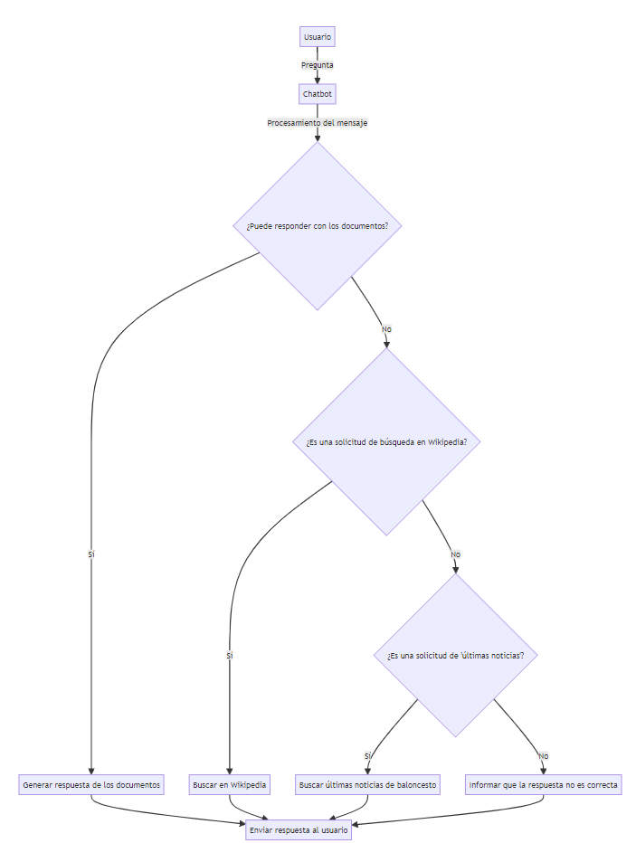

# Funcionamiento del Chatbot
### Introducción
Este chatbot tiene la capacidad de responder preguntas basadas en archivos proporcionados, buscar información en Wikipedia y obtener las últimas noticias sobre baloncesto. A continuación, se detalla cómo funciona cada una de estas características.

### Diagrama conversacional

### Responder preguntas sobre archivos proporcionados
El chatbot puede analizar y entender el contenido de los archivos proporcionados sobre baloncesto. Cuando se le hace una pregunta relacionada con el archivo, el chatbot busca en el contenido del archivo para encontrar la respuesta más precisa y relevante.

> Usuario: ¿Cuál es el tema principal del documento?
> Chatbot: El tema principal del documento es...

## Búsqueda en Wikipedia
El chatbot tiene una función integrada para buscar información en Wikipedia. Cuando se le pide que busque un tema en Wikipedia, el chatbot consulta la página de Wikipedia correspondiente y proporciona un resumen del artículo.

> Usuario: Busca en Wikipedia: Pau GAsol
> Chatbot: Pau Gasol Sáez (Barcelona; 6 de julio de 1980)​ es un exjugador español de baloncesto que disputó 18 temporadas en la NBA...

### Últimas noticias sobre baloncesto
El chatbot también puede buscar las últimas noticias sobre baloncesto. Utiliza fuentes de noticias en línea para encontrar y proporcionar las noticias más recientes y relevantes sobre baloncesto.

> Usuario: Últimas noticias
> Chatbot: Aquí están las últimas noticias sobre baloncesto...

### Conclusión
Este chatbot es una herramienta versátil y poderosa que puede proporcionar respuestas precisas, buscar información en Wikipedia y mantener a los usuarios actualizados con las últimas noticias sobre baloncesto. Su diseño y funcionalidad lo hacen ideal para una variedad de aplicaciones y usos.
